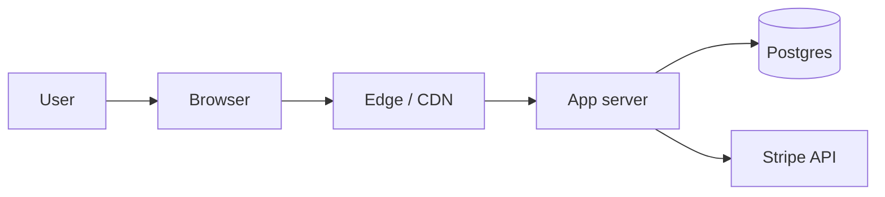

# architecture-design

Architecture is the bridge between "what" (PRD + stories) and "how"
(plan + code). This skill produces the document that every downstream
skill — `design-system`, `planning`, `subagent-development` — reads
to stay consistent.

## Inputs

- `docs/prd.md`
- `docs/user-stories.md`
- `docs/scope-decisions.md`
- `docs/search-first.md`
- `docs/tech-selection.md`

## Output

- `docs/architecture.md`
- `docs/adr/NNNN-{slug}.md` — one file per Architecture Decision
  Record (numbered; 0001, 0002, ...)

## Output structure: architecture.md

```markdown
# Architecture — {project}

## 1. System overview
{1-2 paragraphs, 1 high-level diagram in ASCII or Mermaid}

## 2. Components

Each component:
- Name
- Responsibility (1 sentence)
- Tech (from tech-selection)
- Depends on (other components)
- Owners / source location (dir path in the repo)

## 3. Data model

### Entities
For each entity: fields, types, constraints, indexes.

### Relationships
1:1, 1:N, N:N — state cardinality and referential actions.

### Migrations policy
- Forward-only or reversible?
- Zero-downtime requirement?
- Seed data strategy?

## 4. API surface

One row per endpoint (REST) or operation (GraphQL / RPC):

| Method | Path / Op | Auth | Request | Response | Notes |
|--------|-----------|------|---------|----------|-------|

Include webhooks separately.

## 5. Data flow

For each primary user flow (from user-stories.md), sequence diagram
(Mermaid or ASCII) showing: user -> frontend -> backend -> data
layer -> external services.

## 6. Cross-cutting concerns

- **Auth:** flow (OAuth, session, JWT, ...), where tokens live,
  refresh strategy, logout invalidation.
- **Authorization:** role model, policy location (centralized or
  scattered).
- **Logging:** structured or plain? Which fields are always present?
- **Observability:** error tracking (Sentry?), metrics, tracing.
- **Config:** env vars, secrets management.
- **Error handling:** boundary layers, user-facing error UX.
- **Rate limiting:** where, what limits, by whom.

## 7. Deployment topology

Diagram + environments (dev / preview / prod). CI/CD hand-off.
Rollback story.

## 8. Non-functional posture

Restate the PRD's NFRs with the architecture's answer for each:

| NFR | Target | How the architecture meets it |
|-----|--------|-------------------------------|
| p95 latency < 300ms | ... | edge SSR + DB in same region |
| uptime 99.9% | ... | ... |

## 9. Open questions
{not decisions — things we deferred or don't know yet}

## 10. ADRs
- ADR-0001: {title}
- ADR-0002: {title}
- ...
```

## Output structure: ADR

Each non-obvious choice gets its own file. Format:

```markdown
# ADR-NNNN: {title}

Date: {YYYY-MM-DD}
Status: {proposed | accepted | superseded by ADR-XXXX}

## Context
{1-2 paragraphs on what forced this decision}

## Options considered
1. **{option A}** — pros / cons
2. **{option B}** — pros / cons
3. **{option C}** — pros / cons

## Decision
{chosen option and 1-2 sentence rationale}

## Consequences
- Positive: ...
- Negative: ...
- Neutral / to revisit: ...

## References
- {PRD section, search-first capability, tech-selection row, ...}
```

## When to write an ADR

Write an ADR when the decision is:

- Non-obvious (multiple reasonable options)
- Hard to reverse once code is written
- Likely to be asked about later ("why did we do it this way?")

Do NOT write an ADR for:

- Trivial styling / naming
- Decisions fully explained by tech-selection (skip duplication)
- Things that are easily reversible and low-impact

A good v1 typically has 3-8 ADRs. Zero is suspicious (nothing
important?); 20 is noisy.

## Behavior

1. Read all inputs. Pay particular attention to:
   - User stories that span components (they define data flow)
   - NFRs that constrain topology (latency, compliance, scale)
   - Search-first "Build" decisions (require architectural attention)
2. Draft each section of architecture.md. Use Mermaid for diagrams —
   it renders in GitHub and in the dashboard.
3. Identify non-obvious decisions. For each, draft an ADR.
4. Cross-link: each component in §2 references its ADRs; each ADR
   references the component.
5. Verify that every user story can be traced through §5 data flow.
6. Write files and commit.

## Diagram conventions

Use Mermaid for consistency:



Avoid cramming more than 8-10 nodes per diagram. Split if larger.

## Hard rules

1. **Traceability.** Every component exists because a user story or
   NFR needs it. If you can't justify a component from the PRD, cut
   it.
2. **Don't invent libraries.** The tech stack is from
   `tech-selection.md`. Libraries are from `search-first.md`. If you
   feel the need to introduce something new, stop and add it to
   search-first first.
3. **Optimize for deletion.** Prefer architectures where removing a
   feature is a file deletion, not a surgery. Favor modular boundaries
   over clever shared abstractions.
4. **Boring beats clever.** For a v1, Postgres + server-rendered +
   session cookie beats "event-sourced CQRS with eventual
   consistency" 90% of the time. Reserve cleverness for real
   constraints.
5. **Observable by default.** Every write path has a log line; every
   external call has a timeout and retry policy. Bake this in now so
   planning tasks get it for free.

## Anti-patterns

- **Enterprise-flavored overdesign.** Hexagonal + CQRS + DDD for a
  CRUD v1 is noise. The user stories decide the depth.
- **Mono-ADR.** One giant ADR covering "the architecture" instead of
  discrete decisions. Split.
- **Undocumented trade-offs.** "We chose X" without the "over Y
  because..." is half a decision.
- **Front-loading optimization.** Don't design for scale you haven't
  proven you need. Note scale risks in §9 and revisit.

## Completion

1. Save `docs/architecture.md` and `docs/adr/*.md`.
2. Commit:

   ```
   [design] docs: add architecture and {N} ADRs
   ```

3. **Next skill: `design-system`.** Invoke `design-system` now. Do NOT
   skip ahead to `planning` or any later skill.

## Escalation

If the architecture requires infrastructure the user hasn't
provisioned (a managed DB, an SMTP relay, a third-party API key),
surface a provisioning list:

> Before Build begins, please set up:
> - {service}: {reason}, {link to provisioning doc}
> - ...
>
> Once provisioned, add credentials to .env.example with comments.
> I will not proceed to Phase 3 until these are resolved.
